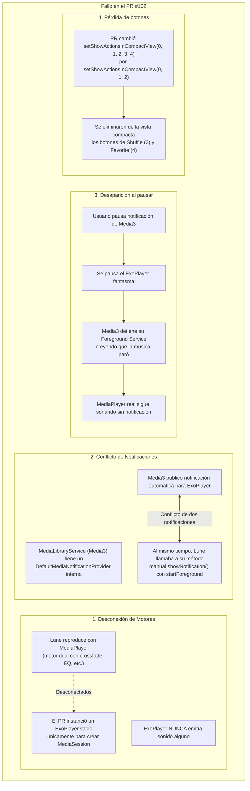
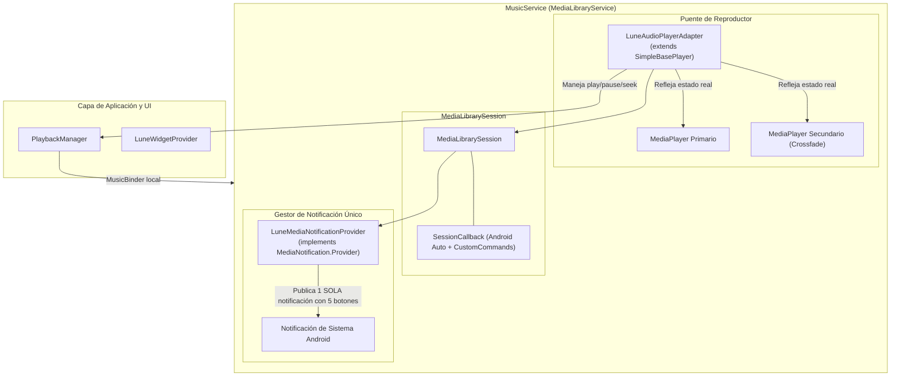

# Análisis Exhaustivo de Arquitectura y Hoja de Ruta: Migración a AndroidX Media3 en Lune

**Proyecto:** Lune Music Player (`com.demonlab.lune`)  
**Fecha de análisis:** 28 de Agosto, 2026  
**Objetivo:** Modernizar la capa de servicio multimedia a AndroidX Media3 (`MediaLibraryService` + `MediaSession`), eliminando avisos de deprecación de `MediaBrowserServiceCompat` y `MediaSessionCompat` sin introducir bugs de duplicación de notificaciones, pérdida de controles ni desincronización de audio.

---

## 1. Diagnóstico Forense: ¿Por qué falló el Pull Request #102?

El Pull Request #102 intentó modernizar `MusicService.kt` de forma superficial para eliminar advertencias de deprecación. El análisis forense de los cambios revela las causas exactas del bug reportado:

---

## 2. Inventario Completo del Motor de Audio de Lune

Cualquier modernización debe respetar de forma inviolable las siguientes 12 capacidades de Lune:

### 2.1. Motor Dual de Audio y Transiciones
* **Reproductor Primario (`mediaPlayer`):** Instancia de `android.media.MediaPlayer` que reproduce la pista actual.
* **Reproductor Secundario (`secondaryPlayer`):** Segunda instancia de `MediaPlayer` empleada para **Crossfade** y **Automix**.
* **Monitor de Transición (`startCrossfadeMonitor`):** Corrutina activa cada 200 ms que calcula el tiempo restante de la pista (`remaining = duration - currentPosition`). Si faltan menos de $X$ segundos (configurable en `SettingsManager`), inicializa el reproductor secundario a volumen 0 y realiza un desvanecimiento cruzado en paralelo.
* **Promoción de Reproductor:** Al concluir el crossfade, el reproductor secundario se convierte en primario, se reasignan listeners de finalización y se recicla el anterior sin interrupción perceptible.

### 2.2. Seamless Looping (Bucle Continuo)
* **Configuración:** Activado mediante `pm.shouldLoopCurrentSong()` y `mediaPlayer.isLooping = true`.
* **Monitor de Wrap-Around:** Detecta cuando la posición del reproductor pasa del final al inicio (`lastPos > duration * 0.8 && currentPos < duration * 0.2`).
* **Protección de Crossfade:** Si la pista está en bucle continuo, el monitor de crossfade se inhabilita para que la transición sea instantánea y no se corte.

### 2.3. Cadena de Procesamiento de Señal (`android.media.audiofx`)
* **Audio Session ID (`getAudioSessionId()`):**
  * Vincula los efectos de audio al motor de reproducción activo.
  * Alimenta el visualizador de ondas (`WaveformVisualizer`) y el visualizador en tiempo real de la pantalla del reproductor.
* **Ecualizador (`Equalizer`):** Bandas dinámicas, rangos de decibelios y presets nativos.
* **Refuerzo de Graves (`BassBoost`):** Fuerza ajustable de 0 a 1000.
* **Audio Espacial / Virtualizador (`Virtualizer`):** Transición mediante rampa matemática suavizada de 15 pasos (`spatialRampJob`) para evitar ruidos de clic/pop al encender o apagar.
* **Efectos Propietarios:**
  * `LoudnessEffect` (`LoudnessEnhancer`): Ganancia en mB.
  * `ReverbEffect`: Presets ambientales.
  * `DynamicsEffect` (`DynamicsProcessing`): Procesador de dinámica multicanal en Android 9+.
  * `BalanceEffect`: Control de balance estéreo izquierdo/derecho mediante `mediaPlayer.setVolume(left, right)`.

### 2.4. Control de Foco de Audio y Eventos Externos
* **Audio Focus (`requestAudioFocus`):** Maneja transiciones para Android O+ (`AudioFocusRequest`) y versiones anteriores.
* **Ducking:** Reduce volumen al 20% ante sonidos breves de notificación (`AUDIOFOCUS_LOSS_TRANSIENT_CAN_DUCK`).
* **Pausa por llamada:** Pausa en `AUDIOFOCUS_LOSS_TRANSIENT` y restaura automáticamente el estado (`wasPlayingBeforeLoss`) al recuperar el foco (`AUDIOFOCUS_GAIN`).
* **Becoming Noisy:** `BroadcastReceiver` que pausa de inmediato si se desconectan auriculares con cable o auriculares Bluetooth (`AudioManager.ACTION_AUDIO_BECOMING_NOISY`).

### 2.5. Android Auto y Navegación Externa
* Expone un árbol de contenido con:
  * `"all_songs"`: Todas las canciones visibles (respetando carpetas ocultas).
  * `"favorites"`: Canciones marcadas como favoritas.
  * `"playlists"`: Listado de listas de reproducción de Room.
  * `"playlist_<id>"`: Pistas pertenecientes a una lista específica.
* Soporta reproducción remota directa mediante identificadores multimedia (`onPlayFromMediaId`).

### 2.6. Controles de Notificación y Bloqueo
* **Vista compacta obligatoria (5 botones):**
  1. `ACTION_PREVIOUS` (Canción anterior)
  2. `ACTION_PLAY` / `ACTION_PAUSE` (Reproducir / Pausar dinámico)
  3. `ACTION_NEXT` (Canción siguiente)
  4. `ACTION_SHUFFLE` (Modo aleatorio con icono dinámico encendido/apagado)
  5. `ACTION_FAVORITE` (Favorito con icono de corazón relleno/borde)
* **Carátula en alta definición:** Obtenida asíncronamente con Coil desde `song.coverUrl` o `song.albumArtUri`.
* **Persistencia:** Notificación continua en primer plano mientras reproduce (`startForeground`), descartable en pausa pero reactivable al reanudar.

### 2.7. Widgets y Temporizadores
* **Widget de Escritorio (`LuneWidgetProvider`):** Actualización periódica cada segundo mientras la pantalla esté encendida.
* **Temporizador de Ahorro de Energía:** Liberación de recursos tras 5 minutos de pausa continuada (`PAUSE_TIMEOUT_MS`).

---

## 3. Arquitectura de la Solución: Migración Correcta a Media3

Para eliminar todas las deprecaciones y unificar el servicio en Media3 sin alterar la lógica de audio de Lune, se debe implementar la siguiente arquitectura:

---

## 4. Componentes Técnicos a Desarrollar

### 4.1. Componente 1: `LuneAudioPlayerAdapter` (`SimpleBasePlayer`)
En AndroidX Media3, `SimpleBasePlayer` es la clase provista por Google para conectar motores de reproducción personalizados a una sesión Media3.

* **Responsabilidades:**
  * Sobrescribir `getState(): State`:
    * `setPlayWhenReady(isPlaying(), PLAY_WHEN_READY_CHANGE_REASON_USER_REQUEST)`
    * `setPlaybackState(if (hasSong) STATE_READY else STATE_IDLE)`
    * `setCurrentPositionMs(mediaPlayer?.currentPosition ?: 0)`
    * `setDurationUs((song.duration * 1000L))`
    * `setAvailableCommands(...)`: Declarar soporte para `COMMAND_PLAY_PAUSE`, `COMMAND_SEEK_TO_DEFAULT_POSITION`, `COMMAND_SEEK_IN_CURRENT_MEDIA_ITEM`, `COMMAND_GET_CURRENT_MEDIA_ITEM`, `COMMAND_GET_TIMELINE`.
  * Manejadores de comandos entrantes:
    * `handleSetPlayWhenReady(playWhenReady)` $\rightarrow$ llama a `resume()` o `pause()`.
    * `handleSeek(index, positionMs, seekCommand)` $\rightarrow$ llama a `seekTo(positionMs.toInt())`.
  * Sincronización:
    * Cuando cambie la canción o el estado de reproducción, se invoca `adapter.invalidateState()`, provocando que Media3 consulte el nuevo estado sin desajustes de reloj.

### 4.2. Componente 2: `LuneMediaNotificationProvider`
Media3 exige que la notificación sea generada a través de su interfaz `MediaNotification.Provider`.

* **Responsabilidades:**
  * Reemplazar el proveedor estándar mediante `setMediaNotificationProvider(luneNotificationProvider)`.
  * Generar un único ID de notificación (ej. `NOTIFICATION_ID = 1001`) y canal `music_playback_channel`.
  * Configurar los **5 botones de la vista compacta** mediante `MediaStyleNotificationHelper.MediaStyle`:
    * Índice 0: Anterior (`ACTION_PREVIOUS`)
    * Índice 1: Reproducir / Pausar (`ACTION_PLAY` / `ACTION_PAUSE`)
    * Índice 2: Siguiente (`ACTION_NEXT`)
    * Índice 3: Aleatorio (`ACTION_SHUFFLE`, con icono reactivo)
    * Índice 4: Favorito (`ACTION_FAVORITE`, con icono de corazón reactivo)
  * Asignar la carátula procesada asíncronamente con Coil.

### 4.3. Componente 3: Comandos Personalizados en `MediaLibrarySession.Callback`
Los botones que no forman parte del transporte estándar de Media3 (Shuffle y Favorite) se deben declarar como comandos personalizados:

* **Comandos:**
  * `SessionCommand(ACTION_SHUFFLE, Bundle.EMPTY)`
  * `SessionCommand(ACTION_FAVORITE, Bundle.EMPTY)`
* **Manejo en `onCustomCommand`:**
  * Cuando el usuario pulsa en la notificación o en la pantalla de bloqueo, Media3 invoca `onCustomCommand`.
  * Se despacha la acción a `PlaybackManager.toggleShuffle()` o `PlaybackManager.toggleFavorite()`.
  * Se actualiza el layout de la sesión con `mediaSession.setCustomLayout(...)`.

### 4.4. Componente 4: Reimplementación de Android Auto en Media3
Migrar la jerarquía de exploración de `MediaBrowserServiceCompat.onLoadChildren` a las APIs de Media3:

| Compat (Antiguo) | Media3 (Moderno) |
| :--- | :--- |
| `onGetRoot` | `onGetLibraryRoot(session, browser, params)` |
| `onLoadChildren` | `onGetChildren(session, browser, parentId, page, pageSize, params)` |
| `onPlayFromMediaId` | `onSetMediaItems` o `onAddMediaItems` + `Player.prepare()` |
| `MediaBrowserCompat.MediaItem` | `androidx.media3.common.MediaItem` |
| `MediaDescriptionCompat` | `androidx.media3.common.MediaMetadata` |

---

## 5. Plan de Ejecución Paso a Paso

1. **Paso 1: Dependencias en Gradle:**
   * Agregar en `gradle/libs.versions.toml`:
     * `media3 = "1.5.1"` (o versión estable más reciente compatible con compileSdk 37)
     * `androidx-media3-session`
     * `androidx-media3-common`
   * Implementar en `app/build.gradle.kts` (no se requiere `exoplayer` completo, ya que `SimpleBasePlayer` reside en `media3-common`).
2. **Paso 2: Construir el `LuneAudioPlayerAdapter`:**
   * Crear la clase que conecta los `MediaPlayer` de Lune con la interfaz `Player` de Media3.
3. **Paso 3: Construir el `LuneMediaNotificationProvider`:**
   * Crear el proveedor que genera la notificación con los 5 botones completos y carátula asíncrona.
4. **Paso 4: Actualizar `MusicService.kt` a `MediaLibraryService`:**
   * Reemplazar la herencia de `MediaBrowserServiceCompat`.
   * Inicializar `mediaSession = MediaLibrarySession.Builder(...)`.
   * Migrar los métodos de Android Auto al callback de Media3.
   * Conectar `onCustomCommand` para Shuffle y Favorite.
   * Mantener intacto el motor de audio (`mediaPlayer`, `secondaryPlayer`, crossfade, EQ, seamless looping).
5. **Paso 5: Ajustar `AndroidManifest.xml`:**
   * Configurar el intent-filter para `androidx.media3.session.MediaLibraryService` y `android.media.browse.MediaBrowserService`.
6. **Paso 6: Pruebas de Calidad y Validación:**
   * Comprobar que **no exista notificación duplicada**.
   * Verificar que pausar desde la notificación funcione y no la haga desaparecer.
   * Verificar que los 5 botones (Prev, Play, Next, Shuffle, Fav) respondan inmediatamente.
   * Verificar que el crossfade y el seamless looping funcionen exactamente igual.
   * Verificar que la compilación concluya con **0 warnings y 0 errores**.

---

## 6. Conclusión

Este análisis demuestra que **es 100% posible modernizar Lune a Media3**, siempre y cuando no se use un reproductor ficticio y se tome el control del proveedor de notificaciones. Este documento servirá como guía exacta para ejecutar la transición sin ningún tipo de regresión.
