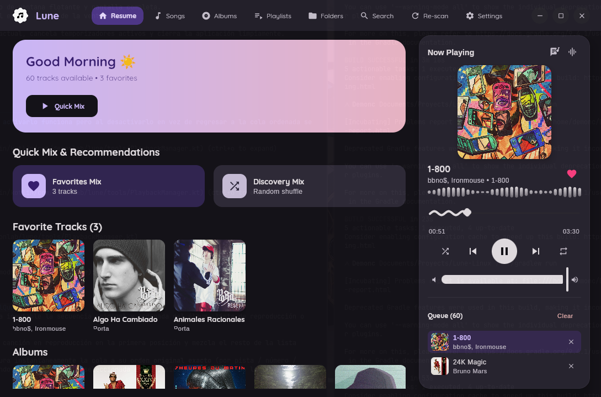

<p align="center">
  
  <br><br>
    <p align="center">
      <a href="https://github.com/MrDemonc/Lune/releases">
        
      </a>
      <a href="https://github.com/MrDemonc/Lune/tree/linux">
        
      </a>
      <a href="https://github.com/MrDemonc/Lune/tree/linux">
        
      </a>
      <a href="https://github.com/MrDemonc/Lune/tree/linux">
        
      </a>
      <a href="https://github.com/MrDemonc/Lune/tree/linux">
        
      </a><br>
      <a href="https://www.paypal.com/paypalme/TommyZambrano">
        
      </a>
      <a href="https://ko-fi.com/mrdemonc">
        
      </a>
      <a href="https://github.com/MrDemonc/Lune/tree/linux#-monero-xmr">
        
      </a>
    </p>
</p>

> **Lune** is a modern, minimalist, and elegant local music player built with **Kotlin** and **Compose Multiplatform Desktop** for Linux. Inspired by the Lune Android experience, tailored natively for desktop environments.

<p align="center">
  
</p>

---

## 🚀 Requirements and System Dependencies

To build and run Lune on Linux distributions, ensure the following packages are installed on your system:

### 1. Mandatory Dependencies

| Dependency                       | Purpose                                                                                                    |
| :------------------------------- | :--------------------------------------------------------------------------------------------------------- |
| **Java JDK 21+**                 | Build environment and application execution (OpenJDK 21 recommended).                                      |
| **FFmpeg**                       | Ultra-low latency audio decoding engine (universal support for FLAC, MP3, WAV, OGG, M4A, AAC, OPUS, ALAC). |
| **PipeWire / ALSA / PulseAudio** | Native Linux audio server for PCM audio output.                                                            |

---

### 2. Dependency Installation by Distribution

#### 📦 Arch Linux / Manjaro / EndeavourOS / Omarchy

```bash
sudo pacman -S jdk21-openjdk ffmpeg pipewire pipewire-pulse pipewire-alsa
```

#### 📦 Ubuntu / Debian / Linux Mint / Pop!\_OS

```bash
sudo apt update
sudo apt install openjdk-21-jdk ffmpeg pipewire pipewire-audio-client-libraries
```

#### 📦 Fedora / RHEL

```bash
sudo dnf install java-21-openjdk-devel ffmpeg pipewire pipewire-pulseaudio
```

#### 📦 openSUSE (Tumbleweed / Leap)

```bash
sudo zypper install java-21-openjdk-devel ffmpeg pipewire
```

---

## 🛠️ Installation & Building

### 🌟 One-Command Universal Installer (Recommended)

You can easily compile, install dependencies, and register Lune into your desktop environment (with application launcher and icons) using the interactive installer:

```bash
chmod +x ./install.sh
./install.sh
```

The installer will:
1. Detect or let you select your Linux distribution (**Arch, Ubuntu/Debian, Fedora, openSUSE, Void**, etc.).
2. Automatically install required build & runtime dependencies.
3. Compile the optimized native standalone application.
4. Install Lune system-wide (`/opt/lune` + global `lune` command) or user-space (`~/.local/share/lune`).
5. Install the official `lune.desktop` launcher and high-resolution system icons.

To uninstall at any time:
```bash
./install.sh --uninstall
```

---

### Quick Run for Development

```bash
./gradlew run
```

### Build All Formats & Distributables (Automated Script)

```bash
./build_dist.sh
```

This script automatically compiles and packages:

- **`dist/lune_1.0.0_amd64.deb`**: Debian/Ubuntu installable package (`sudo dpkg -i dist/lune_1.0.0_amd64.deb` or `sudo apt install ./dist/lune_1.0.0_amd64.deb`).
- **`dist/Lune-Linux-1.0.0-x86_64.tar.gz`**: Portable tarball containing the standalone binary and embedded runtime.
- **`dist/Lune-Linux-1.0.0-x86_64.zip`**: Portable ZIP distribution.
- **`dist/Lune-Portable/`**: Ready-to-run directory (`./bin/Lune` or `./Lune`) for any Linux distro without dependencies.
- **`dist/Lune-1.0.0-all.jar`**: Autonomous executable Uber JAR (`java -jar`).
- **`dist/lune.desktop`**: Desktop application shortcut entry.
- **`dist/SHA256SUMS.txt`**: SHA256 integrity checksums for all release artifacts.

### Manual Gradle Tasks

```bash
# Build standalone native distributable
./gradlew createDistributable

# Build executable Uber JAR
./gradlew packageUberJarForCurrentOS

# Build native packages (DEB / AppImage)
./gradlew packageDistributionForCurrentOS
```

---

## ✨ Key Features

- 🎵 **High-Fidelity Audio Engine**: Direct 16-bit / 24-bit PCM streaming with support for Hi-Res FLAC, ALAC, WAV, MP3, AAC, and OPUS.
- 🎛️ **Floating Side Player**:
  - Clean layout with responsive aspect ratios.
  - Interactive _Wavy Waybar_ progress seeker with rotating diamond thumb.
  - GPU-accelerated _Waveform Visualizer_ powered by Skia OpenGL with zero frame drops in full-screen mode.
- 📜 **Synced Lyrics**:
  - Intelligent vertical expansion of the player when lyrics are toggled.
  - Real-time auto-scrolling, active line highlighting, and instant seek by clicking on any lyric timestamp.
- 📑 **Integrated Queue**:
  - Direct access to upcoming tracks beneath playback controls in regular mode.
  - Seamless track reordering, jumping, and removal with one click.
- 🌐 **MPRIS2 Desktop Media Remote Control**:
  - Full native D-Bus integration (`org.mpris.MediaPlayer2.lune`).
  - Supports system widgets (GNOME, KDE Plasma, Waybar, Polybar, Hyprland, Sway), lock screens, media keys, and `playerctl`.
  - Real-time song metadata and album art sharing via `file://` URIs.
- 🌍 **Multi-Language Support**:
  - Supports System Default, English, Spanish, Portuguese, French, German, Russian, Chinese, and Persian.
- ❤️ **Real-Time Favorites**:
  - Instant synchronization across all tabs (_Resume, Songs, Playlists, Albums, Folders_).
- 🖼️ **In-Memory LRU Cover Cache**:
  - Asynchronous background decoding (`Dispatchers.IO`) with instant 0 ms RAM cache hits for butter-smooth scrolling at 60 / 120 / 144 FPS.
- 🎚️ **10-Band Graphic Equalizer**:
  - Audio presets (_Rock, Pop, Jazz, Electronic, Bass Boost, Vocal, etc._) and spatial enhancement.
- 🎨 **Material 3 Themes & AMOLED Pitch Black**:
  - Custom color palettes (_Default Purple, Sunset Peach, Sage Green, Ocean Breeze, Lavender Mist, Warm Amber_).
  - High-contrast Dark Mode and true **AMOLED Pitch Black** mode.
- 🔒 **100% Offline & Private**:
  - Zero internet permissions, zero telemetry, and zero tracking.

---

## 📂 Project Structure

```
Lune-Linux/
├── src/main/kotlin/com/demonlab/lune/
│   ├── audio/              # PCM audio engine & FFmpeg pipe decoder
│   ├── data/               # Data models (Song, Album, Playlist, Lyrics, Strings/Localization)
│   ├── tools/              # PlaybackManager, MusicProvider, CoverCache, Settings, MPRIS
│   └── ui/
│       ├── components/     # Reusable GPU-accelerated Compose components
│       ├── player/         # Floating player, synced lyrics, and equalizer
│       ├── screens/        # Views (Resume, Songs, Albums, Playlists, Folders, Settings, About)
│       └── theme/          # Material 3 & AMOLED theme palettes
├── build.gradle.kts        # Compose Multiplatform build configuration
├── build_dist.sh           # Universal release distribution packager
└── run.sh                  # Quick-launch script
```

---

## ☕ Support & Donations

If you enjoy using Lune and want to support its ongoing development:

- **PayPal**: [paypal.me/TommyZambrano](https://www.paypal.com/paypalme/TommyZambrano)
- **Ko-fi**: [ko-fi.com/mrdemonc](https://ko-fi.com/mrdemonc)
- <a id="-monero-xmr"></a>**Monero (XMR)**:
  ```
  88s5Re4p6a3P9TtqaG1G2Yeq5Ppp1w1npXebyLjktuxYgurFAGn4GRbKuPKGbx1pD1bBwohtAriL7JqB12ECp4SnMN1T3q9
  ```

---

## 🤝 Credits

- **MrDemonc**: Project Creator & Lead Developer.
- **Desukia**: Design testing, UI/UX suggestions, and official logo art.

---

<p align=center>
  <b><i>💫 Lune - Listen with style 💫</i></b>
</p>
