<div align="center">
  
  <br><br>
  <p align="center">
    
    
    <br>
    <a href="https://www.paypal.com/paypalme/TommyZambrano">
      
    </a>
    <a href="https://ko-fi.com/mrdemonc">
      
    </a>
    <a href="https://github.com/MrDemonc/Lune#-monero-xmr">
      
    </a>
    <a href="https://mrdemonc.github.io/Lune">
      
    </a>
  </p>
  <p align="center">
      اپلیکیشن Lune یه موزیک‌پلیر مینیمال و شیک برای اندرویده که تمرکزش رو زیبایی ظاهری و تجربه کاربری روون و لذت‌بخشه.
    رابط کاربری مدرن با Jetpack Compose ساخته شده، از رنگ‌های داینامیک پشتیبانی می‌کنه و یه سیستم ویجت دارک با افکت محو باکیفیت و خاص داره.
  </p>
</div>

## 🔒 حریم خصوصی و امنیت

توی ساخت Lune، اولویت اول و آخر حریم خصوصیه:

- **دسترسی اینترنت کاملاً صفر**: این برنامه اصلاً پرمیشن `INTERNET` نداره؛ یعنی عملاً به هیچ شبکه، سرور یا سرویسی وصل نمی‌شه.
- **بدون هیچ ردیاب**: خبری از SDKهای آنالیتیکس، تله‌متری، ارسال‌کننده کرش و تبلیغات نیست — هیچی به هیچ سروری گزارش داده نمی‌شه.
- **۱۰۰٪ آفلاین**: همه آهنگ‌ها از حافظه داخلی دستگاه خودت پخش می‌شن. بدون استریم، بدون نیاز به اکانت و بدون وابستگی به کلود.
- **بدون جمع‌آوری داده**: برنامه هیچ اطلاعات شخصی رو جمع نمی‌کنه، ذخیره نمی‌کنه و جایی نمی‌فرسته. همه‌چی فقط و فقط روی گوشی خودت می‌مونه.
- **متن‌باز (Open Source)**: سورس‌کد کامل پروژه توی گیت‌هاب هست تا هرکی خواست بتونه بررسیش کنه. همه‌چی شفافه.
- **حداقل دسترسی‌ها**: فقط پرمیشن‌هایی گرفته می‌شه که واقعاً واسه پخش موزیک و ویژوالایزر لازمه.

## 📱 اطلاعات F-Droid

پروژه Lune کاملاً اوپن‌سورسه و بر اساس استانداردهای بیلد F-Droid درست شده:

- **بیلد خالص با Gradle**: بدون هیچ فایل باینری از پیش‌کامپایل‌شده اختصاصی.
- **متادیتاهای استاندارد**: سازگار با دستورالعمل‌های بیلد F-Droid.

**دریافت برنامه از:**

[](https://f-droid.org/es/packages/com.demonlab.lune/)

## ✨ امکانات

- **رابط کاربری مدرن**: توسعه‌داده‌شده با Jetpack Compose برای محیطی روان و سریع.
- **ویجت اختصاصی و شیک**: ویجت صفحه هوم با افکت دارک بلور حرفه‌ای با قابلیت RenderEffect (برای اندروید ۱۲ به بالا) و بلور نرم‌افزاری باکیفیت برای نسخه‌های قدیمی‌تر.
- **متن زنده آهنگ‌ها (Live Lyrics)**: بخش متن آهنگ با اسکرول همگام و انیمیشن‌های نرم.
- **تم‌های داینامیک**: هماهنگ با تم سیستم و حالت دارک مود.
- **مدیریت صف پخش (Queue)**: امکانات کامل مثل شافل، تکرار و ذخیره‌شدن لیست صف.
- **پلی‌لیست**: ساخت پلی‌لیست‌های دلخواه و دسته‌بندی راحت آهنگ‌ها.
- **قابلیت Automix و Crossfade**: ترنزیشن ۱۲ ثانیه‌ای موقع عوض شدن آهنگ‌ها برای تعویض نرم و بی‌وقفه.
- **تایمر خواب**: تنظیم زمان برای توقف خودکار پخش؛ گزینه‌ها: خاموش، ۱۵ دقیقه، ۳۰ دقیقه و ۶۰ دقیقه.
- **اکولایزر (Equalizer)**: همراه با اکولایزر ۱۰ بانده و پریست‌های آماده، به اضافه ابزارهای پیشرفته پردازش صدا:
  - **Bass Boost**: تقویت بیس آهنگ فراتر از باندهای EQ. اسلایدرها تکون نمی‌خورن ولی خروجی سخت‌افزاری قوی‌تر بیس تولید می‌کنه.
  - **Spatial Audio**: باز کردن و عریض‌تر کردن فضای استریو صدا با افکت `Virtualizer` اندروید، با فعال‌سازی نرم و طبیعی.
  - **Loudness Enhancer**: افزایش بلندی صدا بدون ایجاد نویز و دیستورشن (Clipping). از `LoudnessEnhancer` اندروید استفاده می‌کنه تا بخش‌های آروم آهنگ باکیفیت‌تر شنیده بشن (تنظیم از ۰ تا ۳۰ دسی‌بل).
  - **Balance**: تنظیم توازن صدای چپ و راست. نشانگر وضعیت L (چپ)، C (وسط) و R (راست) رو نشون می‌ده و یه دکمه ریست هم داره تا سریع به وسط برگرده. روی همه تِرَک‌ها اعمال می‌شه.
  - **Reverb**: شبیه‌سازی فضای آکوستیک محیط (از اتاق کوچیک تا سالن کنسرت). بر پایه `EnvironmentalReverb` (اندروید ۱۱ به بالا) با جایگزین `PresetReverb` برای گوشی‌های قدیمی‌تر. دارای ۶ محیط: Room, Hall, Plate, Stage, Arena و Cathedral. جدا از اکولایزر کار می‌کنه.
  - **Pitch**: تغییر سرعت پخش و زیروبم صدا از ۰.۵ برابر تا ۲ برابر. با `PlaybackParams` اندروید کار می‌کنه و واسه تمرین خوانندگی، ساز زدن یا صرفاً فان عالیه.
  - **Dynamics Processor**: فشرده‌سازی داینامیک رنج صدا (کم کردن فاصله بین آروم‌ترین و بلندترین صداها). با ۵ حالت پیش‌فرض:
    - _Light_ (نسبت ۱.۵ به ۱، یکدست‌سازی ملایم)
    - _Medium_ (نسبت ۳ به ۱، مناسب گوش دادن روزمره)
    - _Strong_ (نسبت ۵ به ۱، کمپرس قوی همراه با لیمیتر)
    - _Night_ (نسبت ۸ به ۱، فشرده‌سازی شدید با لیمیتر قوی — عالی واسه گوش دادن شبونه بدون بالا و پایین شدن ناگهانی ولوم)
      از `DynamicsProcessing` اندروید با کمپرسور چندبانده (MBC) و هارد لیمیتر استفاده می‌کنه و مستقل از EQ عمل می‌کنه.
- **Visualizer**: نمایش میله‌های متحرک هماهنگ با ریتم موزیک.
- **دکمه سوییچ تم**: دکمه دم‌دستی برای تغییر سریع حالت روشن و تاریک (یا اتوماتیک بر اساس تم گوشی).
- **پشتیبانی از صدای HI-FI**: قابلیت پخش فرمت‌های صوتی با کیفیت بالا.
- **فرمت‌های صوتی پشتیبانی‌شده**: متکی به `MediaPlayer` اندروید با ساپورت فرمت‌های MP3, AAC (`.aac`/`.m4a`), FLAC, Vorbis (`.ogg`), Opus, WAV, ALAC, AMR, MIDI و MP2.
- **زبان‌ها**: انگلیسی و اسپانیایی.
- **عنوان دلخواه**: امکان تغییر اسم اپلیکیشن از بخش تنظیمات.

## 📱 اسکرین‌شات‌ها

<p align="center">
  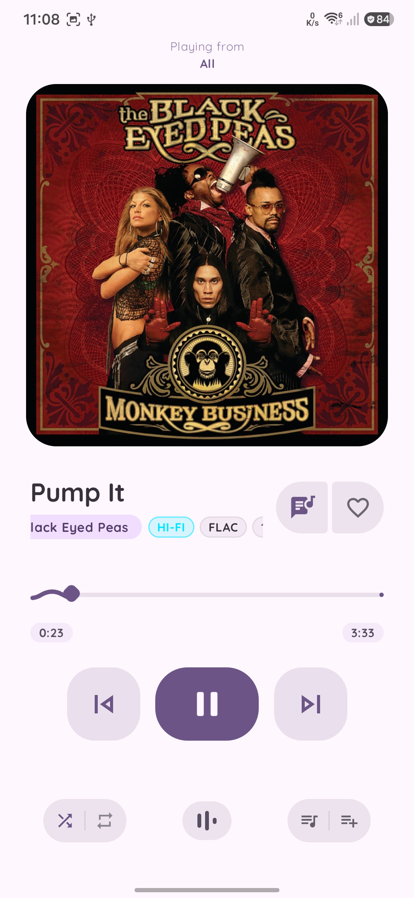
  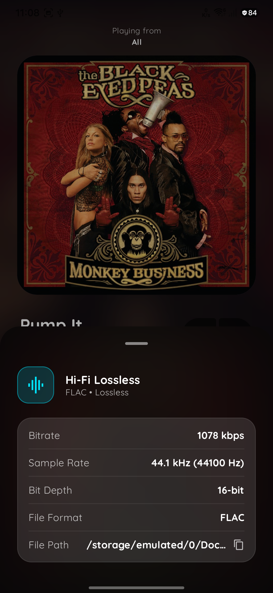
  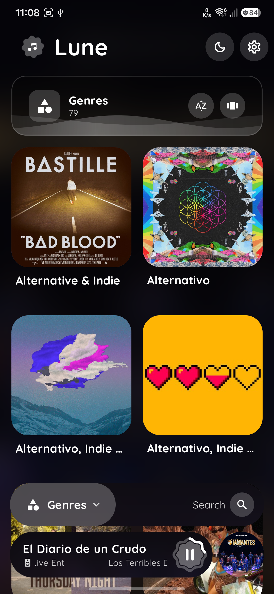
  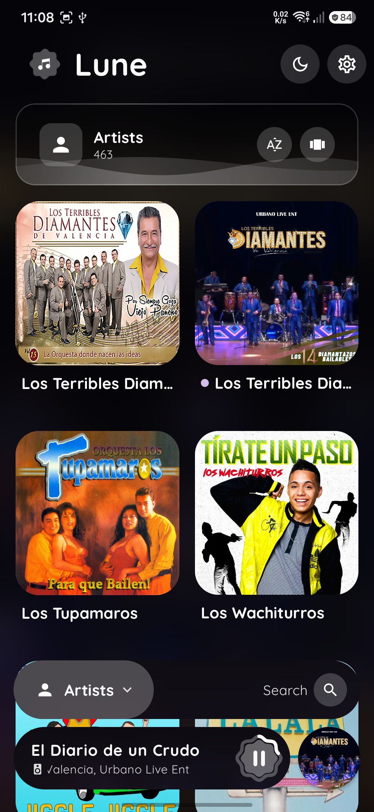
  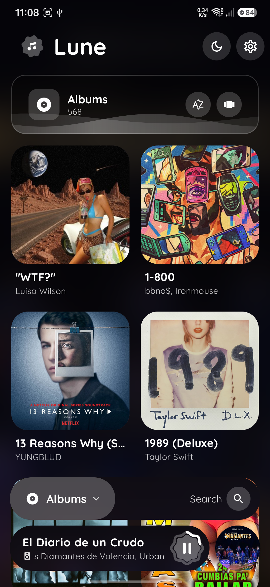
</p>

<p align="center">
  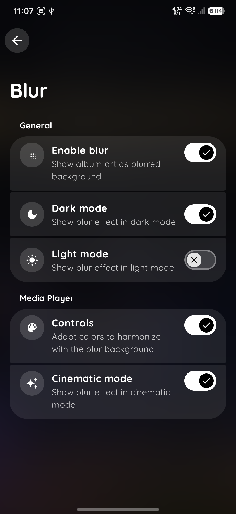
  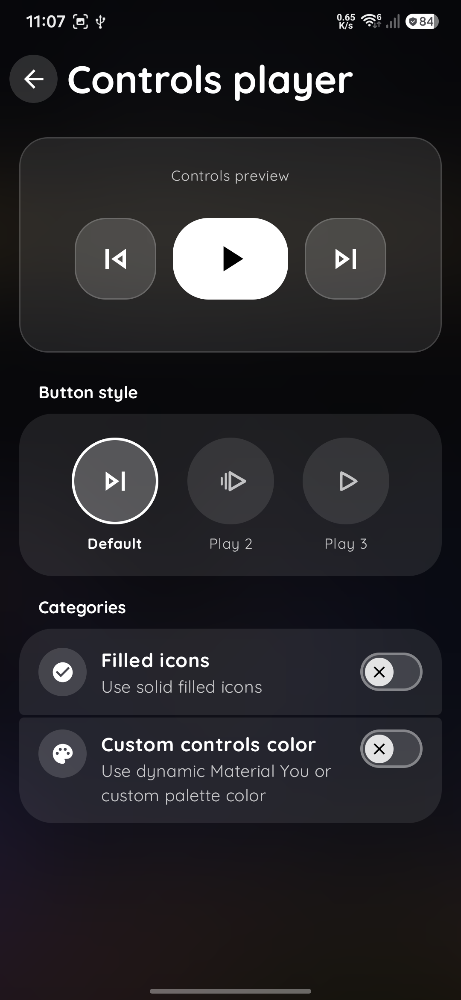
  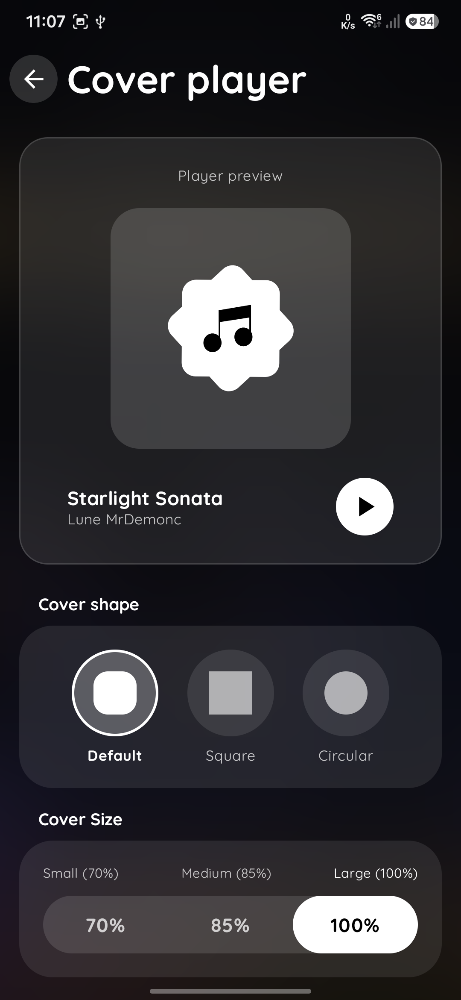
  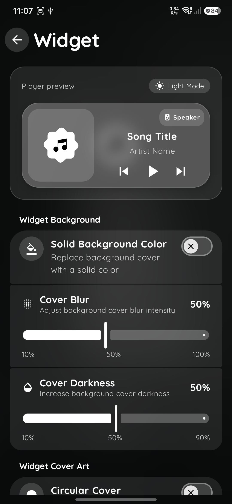
  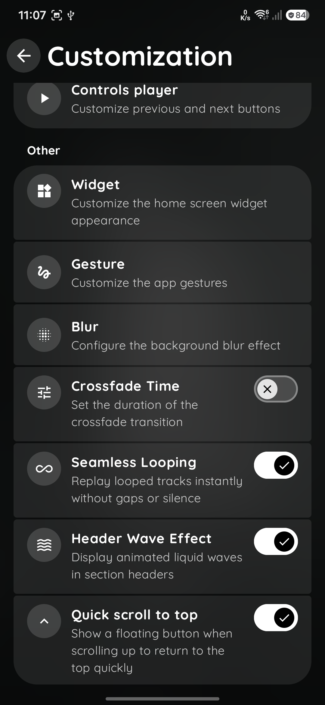
</p>

<p align="center">
  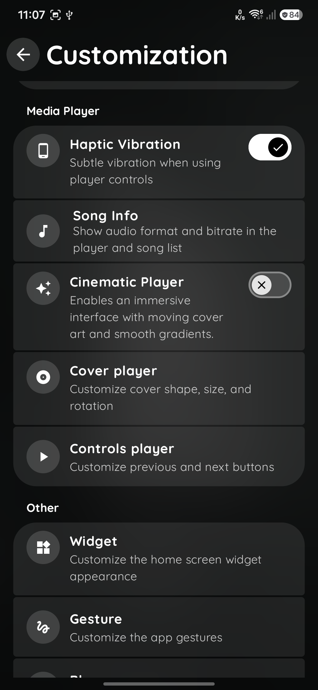
  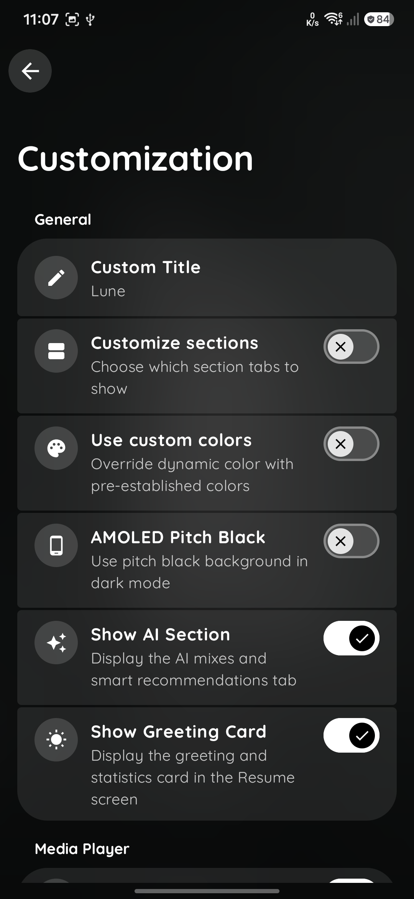
  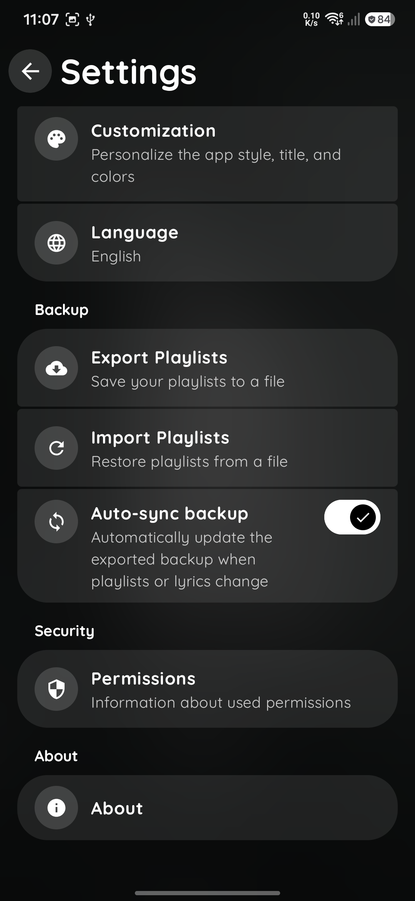
  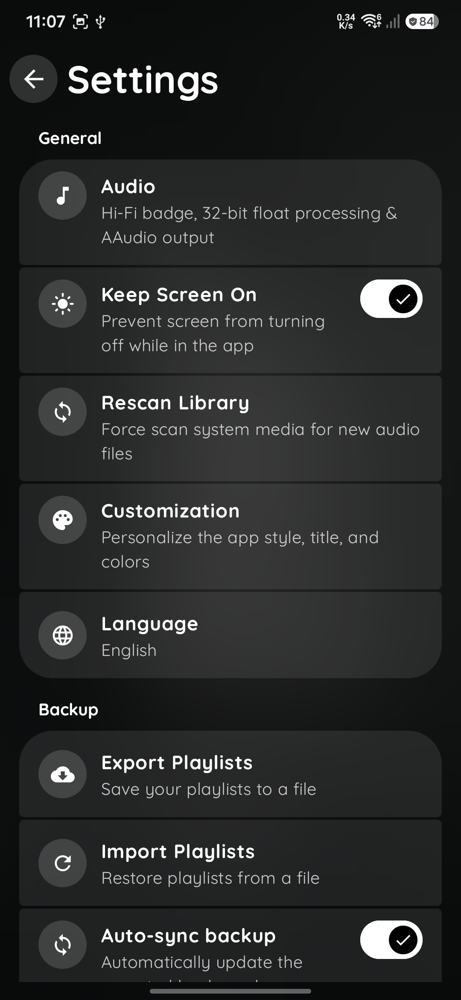
  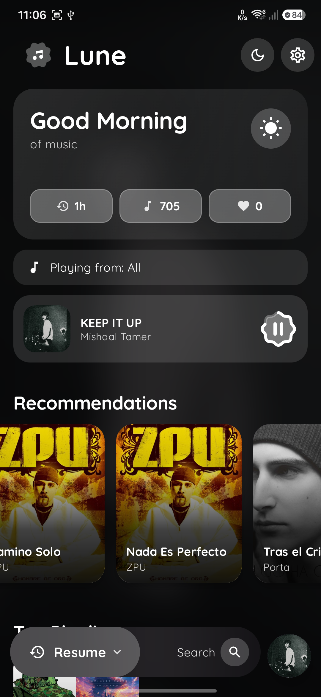
</p>

<p align="center">
  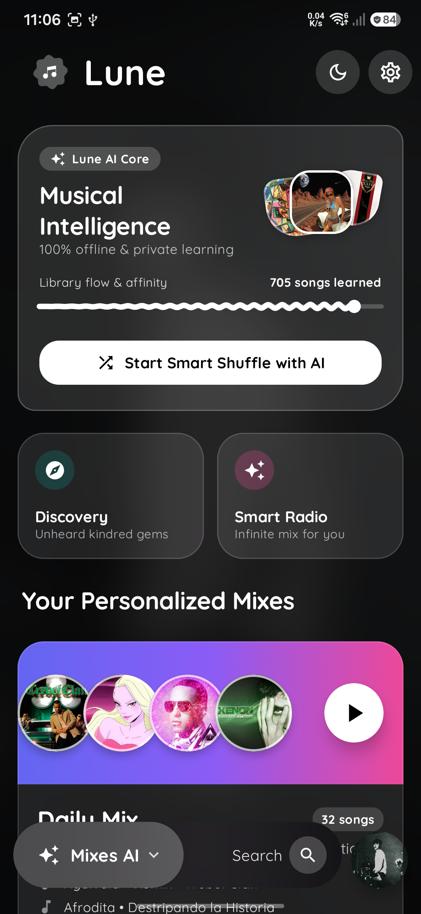
  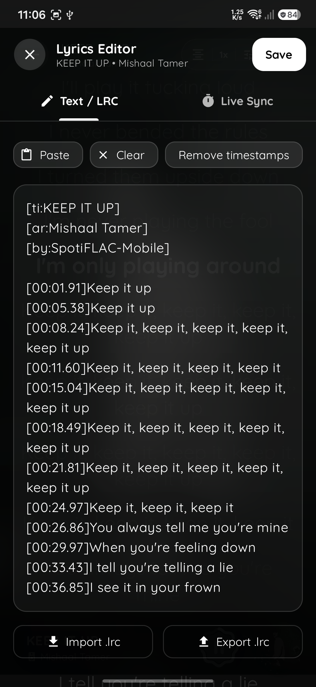
  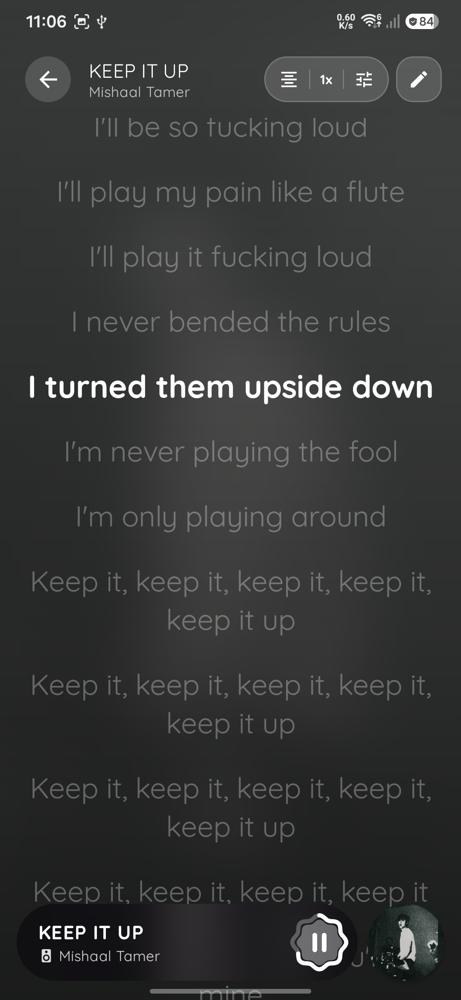
  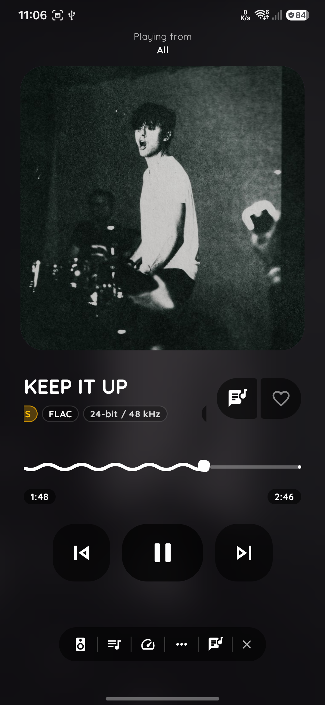
  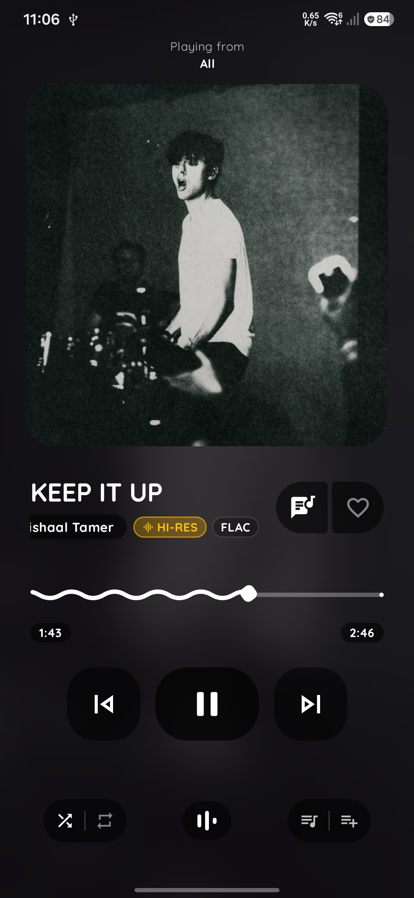
</p>

## 🛠 پیش‌نیازهای بیلد

واسه اینکه بتونی پروژه Lune رو از سورس کامپایل و بیلد کنی، این موارد رو روی سیستمت نیاز داری:

- **JDK 17 به بالا**: برای نسخه فعلی گریدل لازمه.
- **Android SDK 37**: تارگت پروژه روی آخرین APIهای اندروید ۱۷ (SDK 37) هستش.
- **Gradle**: از همون رپر (wrapper) پیش‌فرض پروژه (نسخه 8.x به بالا) استفاده کن.

واسه امضای فایل ریلیز (Sign) این فایل رو بساز:

**keystore.properties**:

```bash
storeFile=key-file.jks
storePassword=password
keyAlias=alias
keyPassword=password

```

## 🚀 نحوه بیلد و خروجی گرفتن

۱. **کلون کردن ریپازیتوری**:

```bash
git clone https://github.com/MrDemonc/Lune.git
cd Lune
```

۲. **تنظیم متغیر محیطی**:
   مطمئن شو که مسیر `ANDROID_HOME` توی سیستمت روی دایرکتوری Android SDK ست شده باشه.
۳. **بیلد از طریق ترمینال**:
   دستور زیر رو اجرا کن تا فایل نصبی (APK) نسخه Release ساخته بشه:

```bash
./gradlew assembleRelease
```

فایل خروجی APK اینجا ذخیره می‌شه: `app/build/outputs/apk/release/Lune-release.apk`

## 👥 کامیونیتی و مشارکت

- [رفتار گروهی (Code of Conduct)](CODE_OF_CONDUCT.md)
- [لایسنس (License)](LICENSE)
- [سیاست امنیت (Security Policy)](SECURITY.md)
- [مستندات فنی (Technical Reference)](TECHNICAL_REFERENCE.md)

## سایر روش‌های دونیت

### ☕ مونرو (Monero - XMR)

```text
monero:88s5Re4p6a3P9TtqaG1G2Yeq5Ppp1w1npXebyLjktuxYgurFAGn4GRbKuPKGbx1pD1bBwohtAriL7JqB12ECp4SnMN1T3q9
```

## 🤝 دست‌اندرکاران

- **MrDemonc**: سازنده و توسعه‌دهنده اصلی پروژه.
- **Desukia**: تست دیزاین و فیدبک‌های تجربه کاربری (UX).

---
